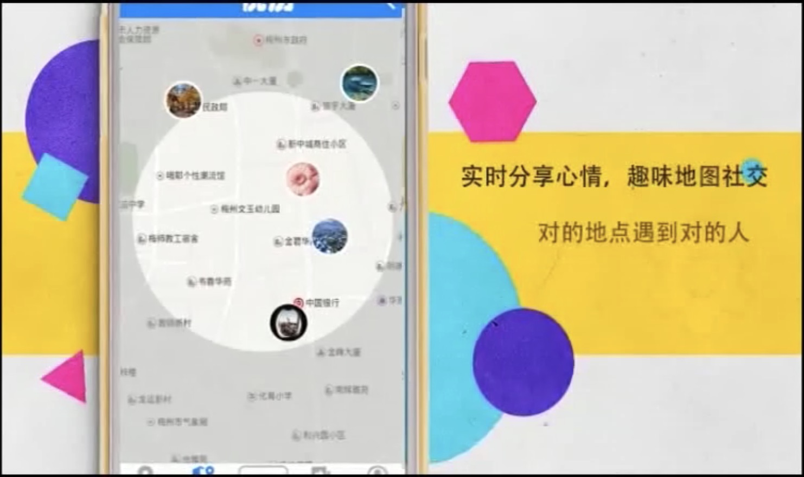
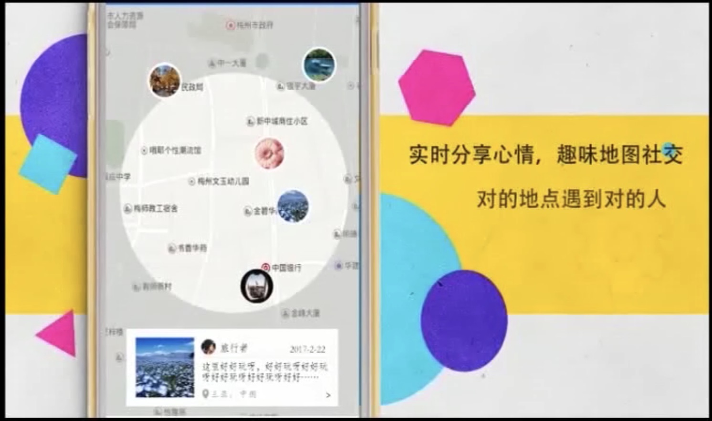

# Yueli
## Yueli-Front
Front-end for Yueli, a tourism mobile app, including user management, scenic spot, travel record, comments, message and feelings. It is developed with Android Studio 3.0

## Selected Functions DisPlay

### easy to sign up and sign in

### daily scenic spot recommendation
| 1 | 2 |
|---------|-------|
|||

### share mood to people around you based on your real-time map
| 1 | 2 | 3 |
|---------|-------|-------|
||||

### view your travel diary 
| 1 | 2 |
|---------|-------|
|||

### view your personal page to record your mood changes
| 1 | 2 |
|---------|-------|
|||

### write down your mood or travel diary
| 1 | 2 |
|---------|-------|
|||

